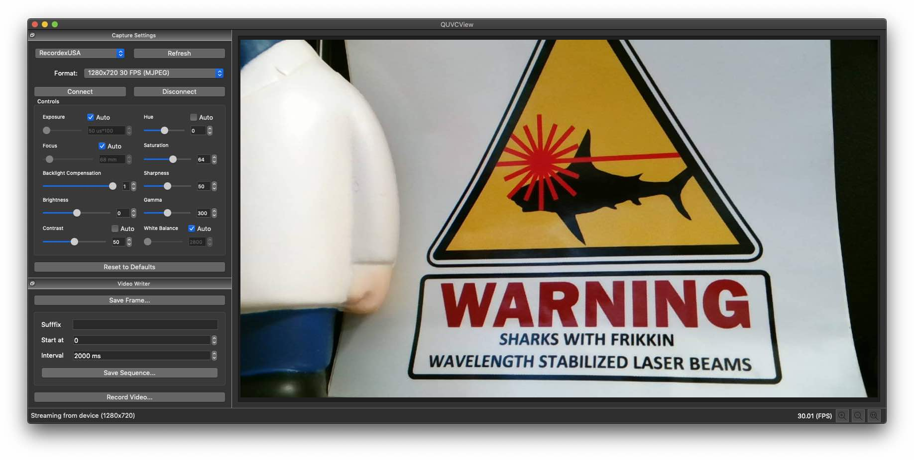

# QUVC View
 macOS will stream video from most UVC cameras, but it does not include support for any UVC controls (focus, exposure, gain, etc). QUVC View is a simple application for controlling and viewing video from UVC compatible USB camera devices built. It is made using Qt (GUI), libuvc (camera communication), and openCV (video writing).

 

## Features
* UVC device discovery
* Read/write most standard UVC device controls (exposure, focus, brightness, contrast, etc..)
* Save videos
* Save still images
* Automatically sequences of images
* Pinch-to-zozom gesture support

## Dependencies
* Qt
* brew install opencv
* brew install libuvc

## See also
* openCV
* libusb
* libuvc https://github.com/libuvc/libuvc
* VVUVCKit https://github.com/mrRay/VVUVCKit
* UVC Camera Control for Mac OS X https://phoboslab.org/log/2009/07/uvc-camera-control-for-mac-os-x
